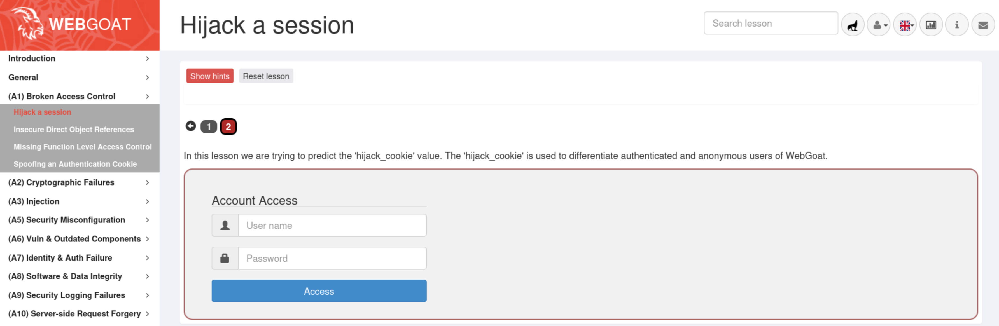

## Мета: Знайомство з A01:2025 Broken Access Control

### Середовище: Kali Linux, Docker engine, OWASP WebGoat container.

### Для кращого розуміння потрібно пройти попередні кроки з мануала WebGoat

В меню обираємо:


Предивляємось постановку завдання:

### Концепція
Розробники прикладного програмного забезпечення, які створюють власні ідентифікатори сесій (session IDs), часто забувають забезпечити рівень складності та рандомізації, необхідний для безпеки. Якщо специфічний ідентифікатор сесії користувача не є складним і випадковим, додаток стає надзвичайно вразливим до атак типу «brute force» (перебір) на сесії.

### Цілі
Отримати доступ до автентифікованої сесії, що належить іншому користувачу.

---

### Основні терміни:
* **Session ID** — ідентифікатор сесії.
* **Complexity and randomness** — складність та випадковість.
* **Brute force attacks** — атаки методом грубої сили (перебору).
* **Authenticated session** — автентифікована сесія (сеанс).

### Далі переходимо на другу вкладинку (червоний колір означає, що потрібно буде щось зробити і це буде перевірятись)



### У цьому уроці ми намагаємося передбачити значення «hijack_cookie». Файл «hijack_cookie» використовується для розрізнення автентифікованих та анонімних користувачів WebGoat.

Спробуємо дослідити за допомогою Burpsuit. Запускаємо його, переходимо на вкладинку "Proxy", запускаємо браузер, в якому відкриваємо "WebGoat" та створюємо користавача і логінуємся або одразу логінуємось (якщо не видаляли контейнер) та переходимо на другий крок:
Вписуємо будь який логін та пароль:
![[Pasted image 20260715160319.png]]
перед тим як натиснути "Access", повертаємось до **burpsuit**, де маємо передивитись вкладинку до Proxy і вмикаємо **Intercept on** :
![[Pasted image 20260715160951.png]]
Після натискання "Access" в браузері бачимо що створилась відповідь **POST** в якої міститься інформація про **hijack_cookie**
![[Pasted image 20260715161309.png]]


Далі натискаємо праву кнопку миші та відправляємо запит до **Repeater**:

![[Pasted image 20260715162009.png]]
В **Repeater** робимо декілька повторів нажимаючи кноку **Send** (в моєму випадку 7 екземплярів **Cookie**):

![[Pasted image 20260715163850.png|697]]
та бачимо, як змінюється значення **hijack_cookie**, копіюємо ці значення в текстовий редактор:

![[Pasted image 20260715164242.png|697]]

Навіть поверхневий аналіз дає висновок про логіку створення кукі, перша частина відповідає за сесію користувача, а друга є **часовою міткою**, або **timestamp**.
```sh
1932206319615440820-1784122577681
1932206319615440821-1784122581551
1932206319615440823-1784122582751
1932206319615440824-1784122583824
1932206319615440825-1784122584452
1932206319615440826-1784122585134
1932206319615440827-1784122586216 
```
Бачимо, що між 1932206319615440821 та 1932206319615440823 може бути сесія 1932206319615440822.
Передаємо запит з сесією 1932206319615440821 до **intruder**:
![[Pasted image 20260715164738.png]]
Далі в **Intruder** формуємо свій запит відповідним чином:
- додаємо **hijack_cookie** 1932206319615440822-1784122581551` (в якому 1932206319615440822 ймовірно сесія іншго користувавча), останні чотири цифри будемо змінювати, такий собі лайтовий брутфорс

![[Pasted image 20260715165139.png]]
Запускаємо **start attack** та чекаємо результатів перебору, однак майже одразу отримуємо позитивний результат:

![[Pasted image 20260715165352.png]]
Та відповідно в завданні вкладинка змінює колір з червоного на зелений:
![[Pasted image 20260715165550.png]]

Завдання пройдено!


